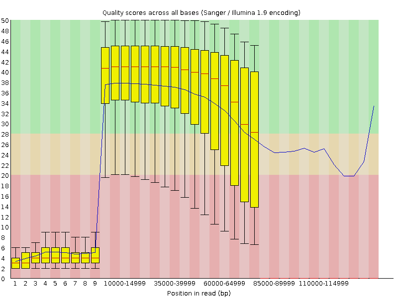
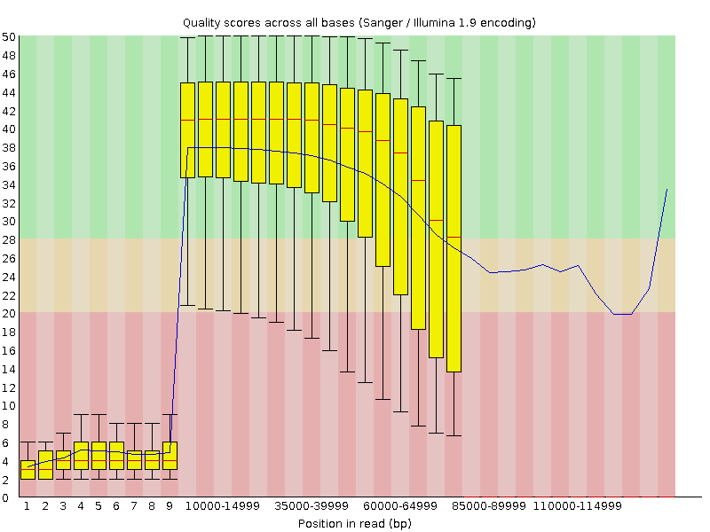
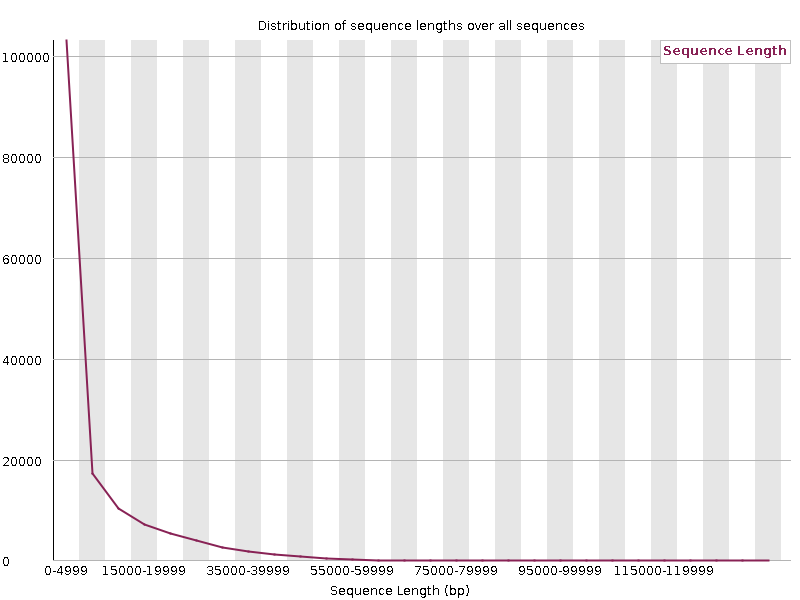

# Assembling a bacterial genome sequence - exploiting long reads

Previously, we assembled the genome sequence of the bacterial strain _Xanthomonas campestris_ pv. _fici_ NCPPB 2372.
We assembled the genome sequence from about a million pairs of short Illumina sequence reads.
This produced a draft-quality genome sequence that was, unfortunately, fragmented into hundreds of contigs.

## The workflow for assembling long reads

Image: [Workflow for long reads](<assembly/Screenshot 2025-10-03 at 16.19.16.png>).

In the following exercise, we will do assembly of only long reads, using an assembly tools called Flye.
Flye is specifically designed to assemble long reads (such as Oxford Nanopore) rather than short reads (such as Illumina).

It can be advantageous to combine short reads plus long reads in the assembly.
If you are interested in knowing more about such a hybrid approach to assembly,
please see this [tutorial about using Unicycler in Galaxy](https://training.galaxyproject.org/topics/assembly/tutorials/unicycler-assembly/tutorial.html).

## Step 1: get the long sequence reads

The long Oxford Nanopore sequence reads for this bacterial genome are in the Sequence Read Archive (SRA)
under accession number [SRR30037665](https://trace.ncbi.nlm.nih.gov/Traces/?view=run_browser&acc=SRR30037665&display=metadata).

Note that the average length of these reads is 6904 bp, and there is a lot of variation, with some reads being much longer. There are
more than 155 thousand reads.

See image: [Summary stats for SRR30037665 at SRA](<assembly/Screenshot 2025-10-02 at 16.47.47.png>).

- Use the [Download and Extract Reads in FASTQ](https://usegalaxy.eu/?tool_id=toolshed.g2.bx.psu.edu%2Frepos%2Fiuc%2Fsra_tools%2Ffastq_dump%2F3.1.1%2Bgalaxy1&version=latest) tool to get SRR30037665 data. ([Image: Getting the data](<assembly/Screenshot 2025-10-02 at 16.22.11.png>))
- For "select input type", choose "SRR accession".
- For "Accession", insert "SRR30037665".
- Press **Run Tool**.

Now we have the long reads in the Galaxy history. You can view the sequence reads in Galaxy.
See image: ([SRR30037665 long reads in Galaxy](<assembly/Screenshot 2025-10-02 at 16.52.51.png>)). Feel free to edit the name of the dataset from "Single-end data (fastq-dump)" to something more informative like "SRR30037665 long ONT reads".

## Step 2:Filter the long reads, using Filtlong

- For "Input FASTQ", choose the SRR30037665 long reads.
- For "Keep percentage", enter "90".
- For "Min. length", enter "1000".
- Press **Run Tool**

See image: [Running Filtlong in Galaxy](<assembly/Screenshot 2025-10-02 at 19.52.20.png>).

Optionally, you could now use FastQC to assess the quality of the long reads before and after filtering.

|                   Quality scores before QC                                        |    Quality scores after QC              |
|   ------------------------------------------------------------------------------  |   ------------------------------------- |
|  |  |

|                   Read lengths  before QC                                        |    Read lengths after QC              |
|   ------------------------------------------------------------------------------  |   ------------------------------------- |
|  |    | 

In this particular case, the quality control has had minimal effect; probably this is bceause the data were quite high-quality to begin with.

## Step 3: Assemble the filtered long reads, using Flye

- Find the [Flye tool in Galaxy](https://usegalaxy.eu/?tool_id=toolshed.g2.bx.psu.edu%2Frepos%2Fbgruening%2Fflye%2Fflye%2F2.9.6%2Bgalaxy0&version=latest).
- For "Input reads", select the filtered long reads.
- For "Mode", select "Nanopore HQ".
- For all other parameters and options, leave the default settings.
- Click on **Run Tool**
 
See image: [Running Flye in Galaxy](<assembly/Screenshot 2025-10-02 at 21.25.53.png>).

Flye will generate four outputs:

- Consensus - this is the assembled genome sequence
- Assembly graph
- Graphical fragment assembly
- Assembly info	

Notice that we have now succeeded in assemblign the genome into just three circular contigs, that correspond to the chromosome and two plasmids:

See image: [Screenshot of assembly info](<assembly/Screenshot 2025-10-02 at 21.33.56.png>).

We can visualise the graphical fragment assembly using Bandage. This helps to illustrate the massive improvement in assembly using long reads versus short reads.

|                 Assembly graph from _short_ reads                                                              |   Assembly graph from _long_ reads              |
| ----------------------------------------------------------------------------------------------------------- | ---------------------------------------------- |
|  |   |

## Step 4: Annotate the Flye-assembled genome sequence with Bakta

We have now achieved a major milestone; we assembled more than a million pairs of short sequence reads into just three much larger contiguous sequences (contigs/scaffolds).
This is a good start, but the assembled sequence consists of just a sequences of nucleotides; we know nothing yet about what genes are present.

Now, we will annotate the genome sequence using an automated annotation tool called Bakta.

- Find the [Bakta tool in Galaxy](https://usegalaxy.eu/?tool_id=toolshed.g2.bx.psu.edu%2Frepos%2Fiuc%2Fbakta%2Fbakta%2F1.9.4%2Bgalaxy1&version=latest).
- For "Select genome in fasta format", use the SPAdes scaffolds file as the input.
- Select the default options for the Bakta databases.
- For "Keep original contig header" (in the "Optional annotation" tab) select "Yes".
- Press the **Run Tool** button to begin.

 Bakta will generate four outputs:

 - a summary,
 - the annotation in GFF3 format,
 - nucleotide sequences of the predicted genes, etc., and
 - a [plot][annotation/Galaxy86-[Bakta on data 61_ Plot of the annotation].svg](<annotation/Galaxy86-[Bakta on data 61_ Plot of the annotation].svg>) of the annotation.

Notice the improvement in the annotation plot in this long-read assembly compared with the previous, short-read assembly:
  

 |                    Bakta annotation on _short_-read assembly                        |                  Bakta annotation on _long_-read assembly                          |
 | ----------------------------------------------------------------------------------  |  --------------------------------------------------------------------------------- |
 |    |   |

 

The plot looks a bit of a mess because there are so many tiny contigs, which take up much of the space on the plot image. Note that most of the genome is
represented in the largest contigs/scaffolds. We know from the QUAST output that about 90% of the total sequence is contained in the largest 41 contigs (or 38 scaffolds).

## Step 5: Visualise the genome assembly in IGV

The GFF3-formatted annotation is useful, because we can view this in an interactive genome browser such as the [Integrative Genome Browser (IGV)](https://igv.org/):

To achieve this, we first need to download the assembled genome sequence from Galaxy:

- Locate the relevant dataset in your Galaxy history. It will be the the FASTA file generated as output from Flye. [Image](<assembly/Screenshot 2025-10-11 at 11.33.03.png>).
- Click on the "disk" icon to download this FASTA file onto your local computer. [Image](<assembly/Screenshot 2025-10-11 at 11.33.40.png>).
- The file will probably appear in your Download folder and will be called something like "Galaxy14-[Flye on data 5_ consensus].fasta".
- Optionally, you can rename the file to soemthing more informative.

We also need the Bakta annotation of this assembled genome sequence:

- Locate the relevant dataset. It will be a GFF3 file generated as output from Flye. [Image](<assembly/Screenshot 2025-10-11 at 11.46.03.png>).
- Click on the "disk" icon to download this GFF3 file onto your local computer. [Image](<assembly/Screenshot 2025-10-11 at 11.47.47.png>).
- The file will probably appear in your Download folder and will be called something like "Galaxy19-[Bakta on data 14_ Annotation and sequences (GFF3)].gff3".
- Optionally, you can rename the file to soemthing more informative.

Now, you can load these files into IGV:

- Navigate to the IGV web application at [https://igv.org/app/](https://igv.org/app/).
- Use the **Genome->Local File** menu item to upload the assembled genome (FASTA file).
- Use the **Tracks->Local File** menu item to upload the assembled genome (GFF3 file).
- After zooming-in, you will see something like this [image](<assembly/Screenshot 2025-10-11 at 14.20.48.png>). Notice the drop-down menu that allows you to switch between the three contigs in this genome assembly.

## Optional Step 9: Visualising the reads aligned against the assembly

If you have time, it can be interesting to align the sequence reads against the assembled genome sequence. 
We can align the long reads and/or the short against the genome assembly.
This allows us to check for consistency between the final assembly versus the raw data from which it was inferred.

Optionally, you can follow this procedure:

- Load the short reads into Galaxy.
You can use the [Faster Download and Extract Reads in FASTQ](https://usegalaxy.eu/?tool_id=toolshed.g2.bx.psu.edu%2Frepos%2Fiuc%2Fsra_tools%2Ffasterq_dump%2F3.1.1%2Bgalaxy1&version=latest)
to get the short sequence reads, via SRR accession number SRR15305418.
- In Galaxy, use [BowTie2](https://usegalaxy.eu/?tool_id=toolshed.g2.bx.psu.edu%2Frepos%2Fdevteam%2Fbowtie2%2Fbowtie2%2F2.5.4%2Bgalaxy0&version=latest) to align the Illumina sequence reads against the assembled genome sequence.
- Perform quality control on the SRR15305418 short sequence reads using [fastp](https://usegalaxy.eu/?tool_id=toolshed.g2.bx.psu.edu%2Frepos%2Fiuc%2Ffastp%2Ffastp%2F1.0.1%2Bgalaxy2&version=latest).
[Image](<assembly/Screenshot 2025-10-11 at 14.31.32.png>).
- Use [BowTie2](https://usegalaxy.eu/?tool_id=toolshed.g2.bx.psu.edu%2Frepos%2Fdevteam%2Fbowtie2%2Fbowtie2%2F2.5.4%2Bgalaxy0&version=latest)
in Galaxy to align the fastp-treated _short_ reads against the assembled genome sequence.
[Image](<assembly/Screenshot 2025-10-11 at 14.33.55.png>).
- Use [lastz](https://usegalaxy.eu/?tool_id=toolshed.g2.bx.psu.edu%2Frepos%2Fdevteam%2Flastz%2Flastz_wrapper_2%2F1.04.22%2Bgalaxy0&version=latest)
to align the filtered _long_ reads against the assembled genome sequence.
[Image](<assembly/Screenshot 2025-10-11 at 14.38.07.png>).

