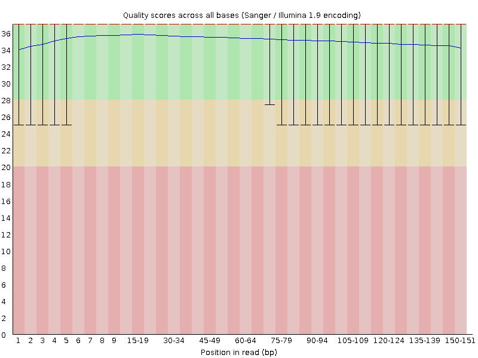
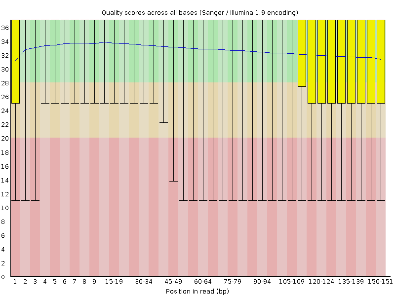
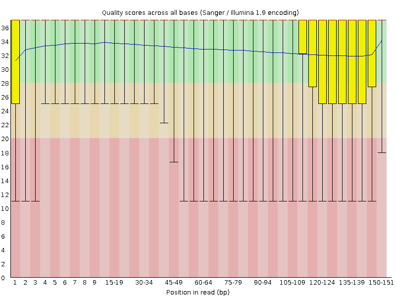

# Assembling a bacterial genome sequence

In this exercise, we are going to perform _de-novo_ assembly of a bacterial genome from short sequence reads. There are many different tools that we could use for genome assembly.
We will use a very commonly-used software tool called SPAdes.

SPAdes can assemble genome sequences from short reads only or it can assemble from a combination of short reads + long reads. Here, we are going to use only short reads.

### The dataset

- We will use a sequencing dataset that has been deposited in the Sequence Read Archive (SRA) under accession number SRR15305418.
- You can find information about this dataset on the SRA website [here](https://trace.ncbi.nlm.nih.gov/Traces/?view=run_browser&acc=SRR15305418&display=metadata).
- The data come from genome sequencing of the bacterial plant-pathogen *Xanthomonas campestris* pv. *fici* strain NCPPB 2372.
- The data consists of 1.1 million pairs of 151-bp sequence reads.
  
### Hands on:  Getting the data into Galaxy

- In Galaxy, create a new history. Give it a relevant name such as "Bacterial genome assembly short reads".
- Find the "Download and Extract Reads in FASTQ format from NCBI SRA" tool in Galaxy [here](https://usegalaxy.eu/?tool_id=toolshed.g2.bx.psu.edu%2Frepos%2Fiuc%2Fsra_tools%2Ffastq_dump%2F3.1.1%2Bgalaxy1&version=latest).
- For "select input type", choose "SRR accession".
- For "Accession", choose "SRR15305418".
- For "Select output format", choose "gzip compressed fastq".
- Press the **Run Tool** button.

See image: [Getting the data from SRA](<assembly/Screenshot 2025-09-30 at 15.36.23.png>).

### Hands on: perform quality control using TrimGalore
 
- In Galaxy, find the [TrimGalore tool](https://usegalaxy.eu/?tool_id=toolshed.g2.bx.psu.edu%2Frepos%2Fbgruening%2Ftrim_galore%2Ftrim_galore%2F0.6.10%2Bgalaxy0&version=latest).
- For "Is this library paired- or single-end?", choose "Paired collection".
- For "Select a paired collection", select the SRR15305418 paired sequence reads that you obtained earlier.
- Press the **Run Tool** button.

See image: [Running TrimGalore](<assembly/Screenshot 2025-09-30 at 15.39.31.png>).

TrimGalore removes poor-quality sequence reads and trims poor-quality ends from otherwise high-quality reads.

TrimGalore results appear in the Galaxy history.

See image: [TrimGalore results in history](<assembly/Screenshot 2025-09-30 at 15.50.46.png>).

### Hands on: check the quality of the sequence data before and after applying filtering + trimming

We will use FastQC and MultiQC to assess the quality of the sequence reads data (which is in FASTQ format).

- Find the [FastQC tool](https://usegalaxy.eu/?tool_id=toolshed.g2.bx.psu.edu%2Frepos%2Fdevteam%2Ffastqc%2Ffastqc%2F0.74%2Bgalaxy1&version=latest) in Galaxy.

See image: [Running FastQC on original data](<assembly/Screenshot 2025-09-30 at 15.54.42.png>).

- Do the same for the post-TrimGalore data too.

See image: [Running FastQC on post-TrimGalore data](<assembly/Screenshot 2025-09-30 at 15.55.35.png>).

FastQC generates various output files. You may need to click on the "eye" icon to display hidden files, in order to see all the FastQC output.

See image: [Results from FastQC](<assembly/Screenshot 2025-09-30 at 16.13.04.png>).

You can now explore and view the FastQC output. Let's compare the data before and after QC with TrimGalore. For example, we could compare the quality-score profiles across the sequence reads:

|               |    Before QC                                                                      |              After QC                                                           |
| ------------- | --------------------------------------------------------------------------------- | ------------------------------------------------------------------------------  |
| Forward reads |  |  |
| Reverse reads |  |  |

Note that the QC with TrimGalore has removed some of the poorer data, but has not drastically changed the profiles. The data were quite good even before QC.

Now that we are content with the quality of the sequence data, we can proceed with the de-novo assembly. But before that, let's make life easier for ourselves by editing the names of the datasets in our Galaxy history. Notice the "pencil" icon, which enables you to edit the names of items in the history.

Here is a view of my Galaxy history before and after manually editing the names of the datasets:

|                         History before manually editing                       |     |              History after manually editing                                 |            
| ---------------------------------------------------------------------------   | --- | --------------------------------------------------------------------------  |
|     |  -> |  | 

### De-novo assembly

Now we are ready to commence the de-novo assembly of genomic sequence reads into as assembled genome sequence. There are many tools that we could use for this job. We will use one of the most commonly used tools, names SPAdes. This usually works very well for microbial genomes, but it will struggle with very large genomes such as those from plants and animals.

SPAdes can assemble genome sequences from short reads only or it can assemble from a combination of short reads + long reads. Here, we are going to use only short reads.

### Hands on: assembling short Illumina reads using SPAdes

- Find the [SPAdes tool](https://usegalaxy.eu/?tool_id=toolshed.g2.bx.psu.edu%2Frepos%2Fnml%2Fspades%2Fspades%2F4.2.0%2Bgalaxy0&version=latest) via  the Tools search box in Galaxy.
- For "Operation mode", select "Assembly and error correction".
- For "Single-end or paired-end short-reads", select "Paired end: list of dataset pairs"
- For the input data, "FASTA/FASTQ file(s): collection", choose the output from the TrimGalore QC step.
- For "Pipeline options", it is recommended to select "Isolate".
- Press the **Run Tool** button to begin.

 See image: [Running SPAdes](<assembly/Screenshot 2025-10-01 at 10.39.43.png>).

When SPAdes has finished running, it will have generated four new files in the Galaxy history:

- Contigs (in FASTA format)
- Scaffolds (in FASTA format)
- Assembly graph (in GFA format)
- Assembly graph with scaffolds (in GFA format)

See image: [SPAdes results in Galaxy history](assembly/spades-results).

### Hands on: view the assembly graph using Bandage

It is fun and interesting to view the assembly graph using [Bandage](https://doi.org/10.1093/bioinformatics/btv383),
which can be run [within Galaxy](https://usegalaxy.eu/?tool_id=toolshed.g2.bx.psu.edu%2Frepos%2Fiuc%2Fbandage%2Fbandage_image%2F2022.09%2Bgalaxy4&version=latest).
Try it! You will generate an image something like this, which illustrates the complexity of the assembly.

See image: [Assembly graph](<assembly/Galaxy28-[Bandage Image on data 25_ Assembly Graph Image].jpg>).

### Hands on: quality checks on the SPAdes genome assembly, using QUAST

What we really want from assembly is the assembled sequence.
This is provided in FASTA format. Notice that there are two files: contigs and scaffolds. In practice, the contigs and scaffolds are usually identical or nearly identical.
The difference is that sometimes SPAdes is able to join two or more contigs together into a larger sequence called a scaffold.

Now, let's do some quality checks on the results of this SPAdes assembly, using a tool called QUAST.

- Find the [QUAST tool within Galaxy](https://usegalaxy.eu/?tool_id=toolshed.g2.bx.psu.edu%2Frepos%2Fiuc%2Fquast%2Fquast%2F5.3.0%2Bgalaxy0&version=latest). You can use the Tools search box.
- For "Assembly mode", choose "Co-assembly".
- For "Contigs/scaffolds file", select the two FASTA files generated by SPAdes: both the contigs file and the scaffolds file.
- Press the **Run Tool** button to begin.

See image:[Running QUAST on the genome assembly](<assembly/Screenshot 2025-10-01 at 11.57.21.png>)

QUAST will now analyse the contigs and scaffolds and report various metrics about those assemblies.

Probably the most informative thing to look at first is the "Cumulative length" plot.

The slightly steeper gradient for the scaffolds indicates that the scaffolds are, on average, slightly bigger than the contigs. This is because several contigs have been combined into scaffolds. The gap between two contigs is padded with "N"s.

## Questions

Can you find the following information about the assembled genome sequence?

- Number of contigs?
- Number of scaffolds?
- N50 length of contigs?
- N50 length of scaffolds?
- Number of Ns in the contigs / scaffolds ?
- Total length of the assembled genome sequence?
- Size of the largets contig / scaffold ?

### Hands on: annotating the genome assembly, using Bakta

We have now achieved a major milestone; we assembled more than a million pairs of short sequence reads into a few hundred much larger contiguous sequences (contigs/scaffolds).
This is a good start, but there are still two major limitations:

1. The assembled sequence consists of just a sequences of nulceotides; we know nothing yet about what genes are present.
2. We do not have a single contiguous sequence that represents the entire chromosome; the sequence is broken into hundreds of small(ish) fragments.

Let's put to one side the second problem, until later. For now, we will address the first problem by identifying genes in the DNA sequence and predicting the functions of those genes.

In other words, we will annotate the genome sequence. We will use an automated annotation tool called Bakta.

- Find the [Bakta tool in Galaxy](https://usegalaxy.eu/?tool_id=toolshed.g2.bx.psu.edu%2Frepos%2Fiuc%2Fbakta%2Fbakta%2F1.9.4%2Bgalaxy1&version=latest).
- For "Select genome in fasta format", use the SPAdes scaffolds file as the input.
- Select the default options for the Bakta databases.
- For "[Keep original contig header](<annotation/Screenshot 2025-10-01 at 14.50.26.png>)" (in the "Optional annotation" tab) select "Yes".
- Press the **Run Tool** button to begin.

 Bakta will generate four outputs:

 - a [summary](<>),
 - the [annotation](<>) in [GFF3 format](https://www.ensembl.org/info/website/upload/gff3.html),
 - [nucleotide sequences](<>) of the predicted genes, etc., and
 - a [plot](<>) of the annotation.

The plot looks a bit of a mess because there are so many tiny contigs, which take up much of the space on the plot image. Note that most of the genome is
represented in the largest contigs/scaffolds. We know from the QUAST output that about 90% of the total sequence is contained in the largest 41 contigs (or 38 scaffolds).

The GFF3-formatted annotation is useful, because we can view this in an interactive genome browser such as the [Integrative Genome Browser (IGV)](https://igv.org/).

  

