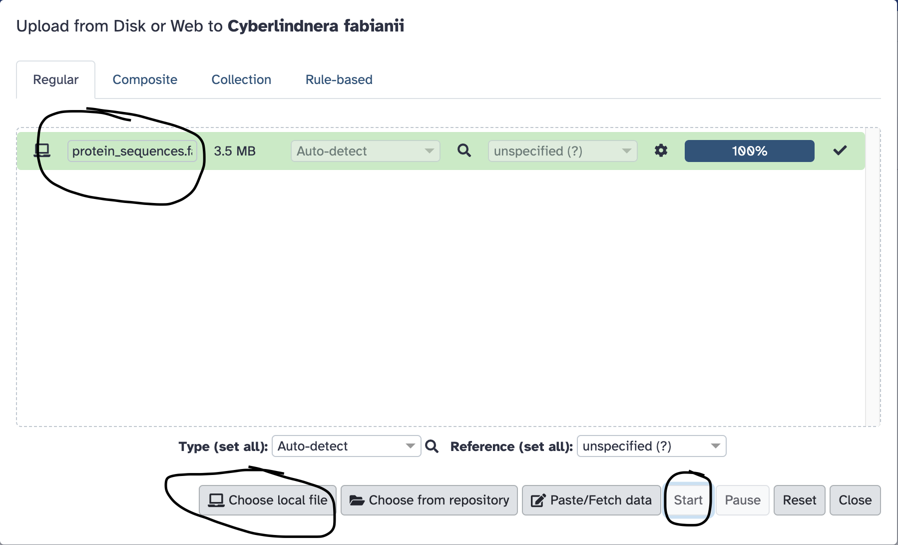

Previously, we obtained a fungal genome sequence and then masked its repeat sequences using RepeatModeller + RepeatMasker.

Now, we will use that masked genome sequence as the input for genome annotation. In other words, we will search the genome for features such as protein-coding genes.

### Preparing data

The Braker3 pipeline exploits amino-acid sequences from known proteins to aid its gene prediction. I have provided a suitable set of protein sequences in this file:
[protein_sequences.fasta](annotation/protein_sequences.fasta.gz). In case you are curious about where I got these protein sequences,
I downloaded them from [here](https://www.uniprot.org/proteomes/UP000002311) and [here](https://www.uniprot.org/proteomes/UP000189513) and cmbined them into a single FASTA file.

- Download [protein_sequences.fasta](annotation/protein_sequences.fasta.gz) file onto your computer.
- Upload this file into Galaxy, using the **Upload** button near the top-left of the Galaxy web page.

  

Once the upload has completed, the protein-sequences file will appear in your Galaxy history. You can view the file to see the protein sequences by clicking on the "eye" icon fo the dataset.

### Hands on: run Braker3 on the masked fungal genome sequence

- Search for Braker3 in the Galaxy Tool search box. That will take you to [here](https://usegalaxy.eu/?tool_id=toolshed.g2.bx.psu.edu%2Frepos%2Fgenouest%2Fbraker3%2Fbraker3%2F3.0.8%2Bgalaxy2&version=latest).
- For "Genome sequence is soft-masked" select "Yes".
- For "Species name", optionally insert "Cyberlindnera fabianii".
- For "RNA-seq mapped to genome to train Augustus/GeneMark", choose "Nothing selected". (No RNA-seq data is availabke for this species.)
- For "Proteins to map to genome", choose the protein sequences that you uploaded previously.
- For "Fungal genome", choose "Yes".
- For "Output format", choose "GFF3". (You need to scroll down to find this.)
- Pres the **Run Tool** button to start the genome annotation process.

The output from Braker3 is a file in [GFF3 format](https://www.ensembl.org/info/website/upload/gff3.html) that describes the position of each predicted gene (and other genomic features). GFF3 is a standard
bioinformatics format for describing features on a DNA sequence.
