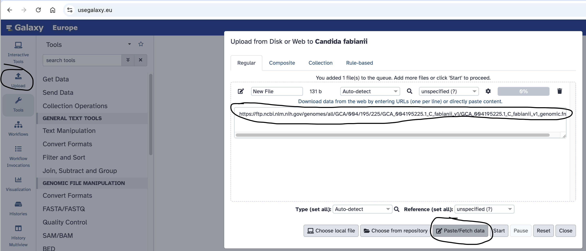
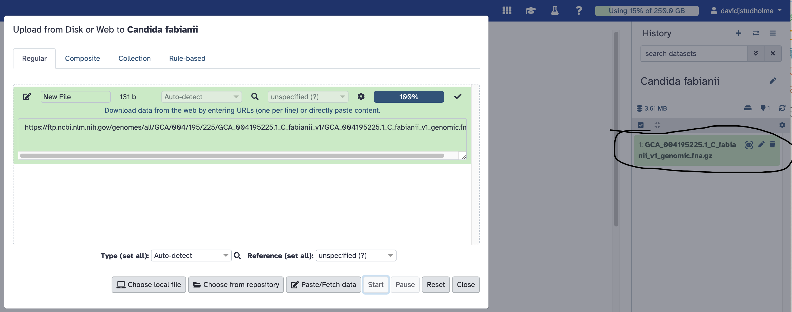

# Masking repeats in a genome assembly

## The scenario

We have previously assembled a genome sequence for a eukaryotic organism. This genome assembly consists of a set of contiguous sequences (contigs) in FASTA format.
This is just DNA sequence. We have not yet analysed this DNA sequence to find protein-coding genes and other genomic features. Before we do that, we first need to elininate the repetitive sequences from the genome sequence. In this computer practical, we will identify and "mask" the repetitive sequences from our assembled genome sequence.

## Repeat-masking in eukaryotes versus prokaryotes
Note that this repeat-masking step is nearly always necessary before annotating a eukaryotic genome sequences. Most eukaryotic genomes are very rich in repeat sequences such as transposons, short tandem repeats, interspresed nuclear elements, etc.
For prokaryotic genomes (bacteria and archaea) this step is usually not necessary, since prokaryotic genomes are very gene-dense and have relatively little repetitive sequence.

## The dataset
For this exercise, we will use a eukaryotic genome, but a relatively small one. A similar approach could be taken to repeat-masking a much larger genome, but it would take longer and require greater computational resources. We will use genome sequence data generated at Exeter.

- _Cyberlindnera fabianii_ Ex2 [GenBank: GCA_004195225.1](https://www.ncbi.nlm.nih.gov/datasets/genome/GCA_004195225.1/)
- _Hyaloperonospora arabidopsidis_ Noks1 [GenBank: GCA_001414525.2](https://www.ncbi.nlm.nih.gov/datasets/genome/GCA_001414525.2/)
- _Hyaloperonospora arabidopsidis_ Cala2 [GenBank: GCA_001414265.2](https://www.ncbi.nlm.nih.gov/datasets/genome/GCA_001414265.2/)
- _Fusarium oxysporum_ f. sp. _cubense_ TR4 [GenBank: GCA_001414525.2](https://www.ncbi.nlm.nih.gov/datasets/genome/GCA_007994515.1/)

### Hands on: get the data
First, we need to get the genome sequence into Galaxy. The sequence is available as a compressed FASTA file at the NCBI's FTP site
[here](https://ftp.ncbi.nlm.nih.gov/genomes/all/GCA/004/195/225/GCA_004195225.1_C_fabianii_v1/GCA_004195225.1_C_fabianii_v1_genomic.fna.gz).

So, we can direct Galaxy to this web address.
- Create a new Galaxy history, called "Cyberlindnera fabianii".
- Copy the link location "https://ftp.ncbi.nlm.nih.gov/genomes/all/GCA/004/195/225/GCA_004195225.1_C_fabianii_v1/GCA_004195225.1_C_fabianii_v1_genomic.fna.gz" to your clipboard.
- Click the **Upload Data** button near the top-left of the Galaxy page.
- Select the **Paste/Fetch Data** button.
- Paste the link into the text field:

- Press the **Start** button.

When the file has finished uploading into Galaxy, you will see it appear in your history, near the top-right of the Galaxy page:

Now, we are ready to use the [RepeatModeller](https://usegalaxy.eu/?tool_id=toolshed.g2.bx.psu.edu%2Frepos%2Fcsbl%2Frepeatmodeler%2Frepeatmodeler%2F2.0.5%2Bgalaxy0&version=latest) 
tool to search for repetitive sequences in this uploaded genome sequences.

