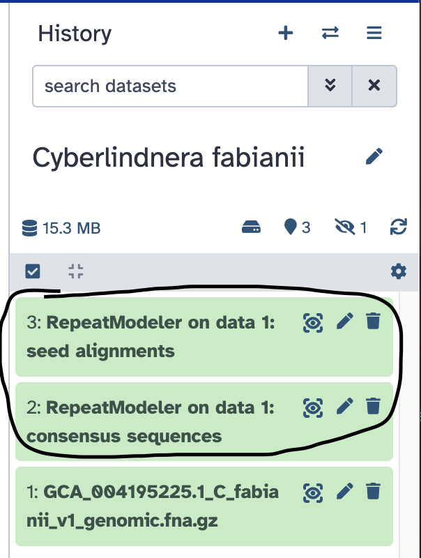

# Masking repeats in a genome assembly

## The scenario

We have previously assembled a genome sequence for a eukaryotic organism. This genome assembly consists of a set of contiguous sequences (contigs) in FASTA format.
This is just DNA sequence. We have not yet analysed this DNA sequence to find protein-coding genes and other genomic features. Before we do that, we first need to elininate the repetitive sequences from the genome sequence. In this computer practical, we will identify and "mask" the repetitive sequences from our assembled genome sequence.

## Repeat-masking in eukaryotes versus prokaryotes
Note that this repeat-masking step is nearly always necessary before annotating a eukaryotic genome sequences. Most eukaryotic genomes are very rich in repeat sequences such as transposons, short tandem repeats, interspresed nuclear elements, etc.
For prokaryotic genomes (bacteria and archaea) this step is usually not necessary, since prokaryotic genomes are very gene-dense and have relatively little repetitive sequence.

## The dataset
For this exercise, we will use a eukaryotic genome, but a relatively small one. A similar approach could be taken to repeat-masking a much larger genome, but it would take longer and require greater computational resources. We will use genome sequence data generated at Exeter.

- _Cyberlindnera fabianii_ Ex2 [GenBank: GCA_004195225.1](https://www.ncbi.nlm.nih.gov/datasets/genome/GCA_004195225.1/)
- _Hyaloperonospora arabidopsidis_ Noks1 [GenBank: GCA_001414525.2](https://www.ncbi.nlm.nih.gov/datasets/genome/GCA_001414525.2/)
- _Hyaloperonospora arabidopsidis_ Cala2 [GenBank: GCA_001414265.2](https://www.ncbi.nlm.nih.gov/datasets/genome/GCA_001414265.2/)
- _Fusarium oxysporum_ f. sp. _cubense_ TR4 [GenBank: GCA_001414525.2](https://www.ncbi.nlm.nih.gov/datasets/genome/GCA_007994515.1/)

### Hands on: get the data
First, we need to get the genome sequence into Galaxy. The sequence is available as a compressed FASTA file at the NCBI's FTP site
[here](https://ftp.ncbi.nlm.nih.gov/genomes/all/GCA/004/195/225/GCA_004195225.1_C_fabianii_v1/GCA_004195225.1_C_fabianii_v1_genomic.fna.gz).

So, we can direct Galaxy to this web address.
- Create a new Galaxy history, called "Cyberlindnera fabianii".
- Copy the link location "https://ftp.ncbi.nlm.nih.gov/genomes/all/GCA/004/195/225/GCA_004195225.1_C_fabianii_v1/GCA_004195225.1_C_fabianii_v1_genomic.fna.gz" to your clipboard.
- Click the **Upload Data** button near the top-left of the Galaxy page.
- Select the **Paste/Fetch Data** button.
- Paste the link into the text field:

- Press the **Start** button.

When the file has finished uploading into Galaxy, you will see it appear in your history, near the top-right of the Galaxy page:

Now, we are ready to use the [RepeatModeller](https://usegalaxy.eu/?tool_id=toolshed.g2.bx.psu.edu%2Frepos%2Fcsbl%2Frepeatmodeler%2Frepeatmodeler%2F2.0.5%2Bgalaxy0&version=latest) 
tool to search for repetitive sequences in this uploaded genome sequences.

### Hands on: identify repeat sequences using RepeatModeller

- Search for the RepeatModeller tool in the Tools search box (top left of the Galaxy web page)
- For "Input genome fasta", select the genome sequence that you uploaded into Galaxy previously.
- Press either of the **Run Tool** buttons.

After the RepeatModeller tool has finished running, you will see the results appear in your Galaxy history.

Now that we have a library of repeat sequences, identified in this genome, we can proceed to searching for all instances of those repeats and masking them in the genome sequence. For that, we will use the [RepeatMasker tool](https://usegalaxy.eu/?tool_id=toolshed.g2.bx.psu.edu%2Frepos%2Fbgruening%2Frepeat_masker%2Frepeatmasker_wrapper%2F4.1.5%2Bgalaxy0&version=latest).

### Hands on: scan the genome sequence against library of repeat sequences

- Search for the RepeatMasker tool in the Galaxy Tool search box.
- For "Genomic DNA", select the genome sequence file that you uploaded to Galaxy previously.
- For "Repeat library source", select Dfam.
- For "Select species name from a list", select Yes.
- For "Species", select Human.
- For "Output annotation of repeats in GFF format", choose Yes.
- For "Perform soft-masking instead of hard-masking", choose Yes.
- Press the **Run Tool** button to begin.

**Note** that we select human as the species even though we are analysing a non-human (fungal) genome. There is no bespoke library of repeats available for our fungal genome that we can simply choose "off the shelf". Instead, we use a library of human repeat sequences that includes many common repeats found in many organisms. we can refine this later by using the library of repeats that we generated speciically from this genome using RepeatModeller. But we will start by simply searching against human repeat sequences.

After running RepeatMassker, the results will appear in your Galaxy history:

RepeatMasker has created five output files:

- Masked sequence
- Repeat statistics
- Output log
- Repeat catalogue
- Repeat annotation

Let's take a look at the masked sequence:

Notice that RepeatMasker has found a match to a known repeat sequence (from the human repeat library). It has trasnformed the sequence into lowercase. In other words it has "soft masked" this sequence.

### Question: what proportion of the genome has been masked? 

You can find the answer among the RepeatMasker results in your Galaxy history:

Here, you can see that only 1.16 % of the fungal genome has been masked, based on searching against human repeats. This indicates that we probably need to search against the species-specific repeats too.

  

  

